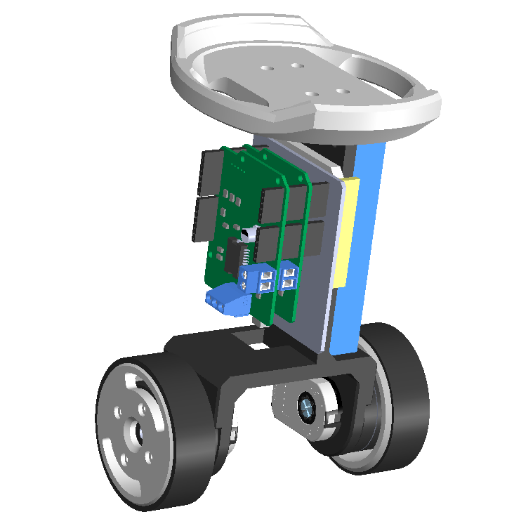

# Arduino-FOC-balancer
Arduino two wheel balancing robot based on simplefoc library. Full docs comming soon!

For now you can find the Arduino code and Solidworks files in the repo.

 

## Youtube videos of testing:

