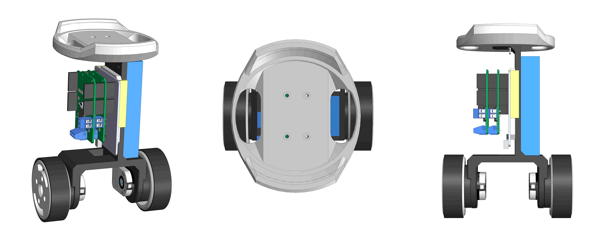
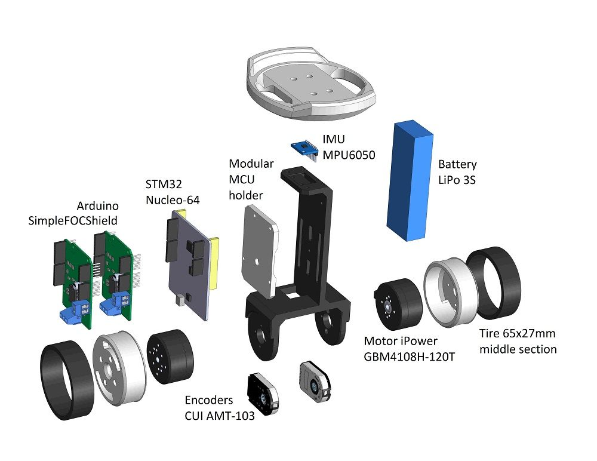
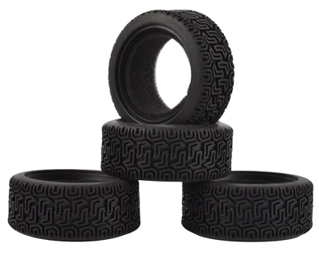
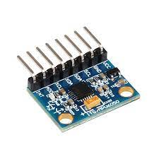
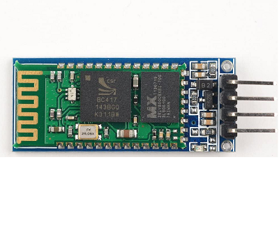
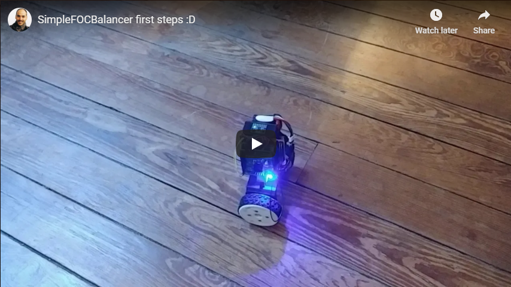
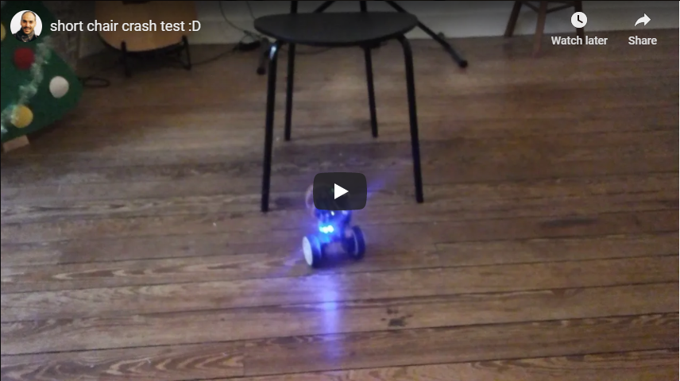

# Arduino *Simple**FOC**Balancer*

Exiting Arduino two wheel balancing robot based on gimbal BLDC motors and *Simple**FOC**library*.

Balancing robots are always a bit tricky to design, in order to make the robot balance we need to design and tune our mechanical structure and the control algorithm and, in the same time, choose optimal motors, sensors and microcontrollers. Therefore, even though BLDC motors are a great choice for balancing robots the complexity of their control made them undesirable. So this robot is an attempt to create a simple and modular, BLDC motor based, balancing robot that can be easily adapted for different *motor+sensor+mcu+driver* combinations and to show of the power and the awesome dynamics of gimbal BLDC motors 😄

## Readme structure

## Mechanical components

### 3D printed parts
This balancer project has 5 3d printed parts. You can find them in the `CAD > STL` directory. They are:
- center frame (`FOC_balancer.stl`)
    - infill: `30%`
    - layer hight: `>0.15mm`
- wheels (`wheel.stl`) 
    - infill: `30%`
    - layer hight: `0.1-0.15mm`
    - ***reasonably precise***
- MCU mount (`arduino_holder.stl`)
    - infill: `30%`
    - layer hight: `>0.15mm`
- top plate (`top_plate.stl`)
    - infill: `20%`
    - layer hight: `>0.15mm`

I have printed the pendulum in the PLA filament but there should be no real difference in using PETG or ABS filaments, this is just what I had in hand at the moment.

You will also find all the CAD files used in this project in the `CAD` folder. I have included the Solidworks 2016 parts and the full assembly. Additionally all the parts are exported to STEP format for easier porting to the other CAD IDEs.

> Beware: 
I have designed the holes on the pendulum arm and the wheel to match perfectly the motor the encoders I was using, so please check the dimensions of your motors and encoder holes before printing 😄
***If you would prefer some other CAD format, let me know, maybe I can export it differently.***

## Hardware parts

The mechanical components you will need are two sets of screws which you can easily find in your hardware store and the RC car tires that can be bought in bulk online. 

Component | Description | Link | Price
---- | ---- | ---- | ----
 |M3 screws  25pcs   M3x10mm | [Ebay](https://www.ebay.com/itm/M2-M2-5-M3-M4-M5-M6-M8-Stainless-Steel-Metric-Hex-Socket-Head-Cap-Screws-Bolt/123439613021?hash=item1cbd93045d:m:mQsuAChkph7G_5vk5ctmQiA) | 2$
 | M4 screws & nuts  2pcs   M4x50mm | [Ebay](https://www.ebay.com/itm/M2-M2-5-M3-M4-M5-M6-M8-Stainless-Steel-Metric-Hex-Socket-Head-Cap-Screws-Bolt/123439613021?hash=item1cbd93045d:m:mQsuAChkph7G_5vk5ctmQiA) | 4$
 |RC wheel  HSP HPI 8014  2pcs   69.5mmx29mm | [Aliexpress](https://www.aliexpress.com/item/32947563689.html?spm=a2g0o.productlist.0.0.34ab4d37nYx9A3&algo_pvid=b21cd1b2-6d81-4d1d-b59a-3b3d6fc8fd53&algo_expid=b21cd1b2-6d81-4d1d-b59a-3b3d6fc8fd53-0&btsid=0b0a0ae216165290457024490eec73&ws_ab_test=searchweb0_0,searchweb201602_,searchweb201603_) | 5$

## Electrical components
### BLDC motor
The BLDC motors I was using in my video are an old versions of the [iPower GM4108](https://shop.iflight-rc.com/index.php?route=product/product&product_id=217&search=GM4108H-120T) motors which are not available anymore, in any case I was not able to find a website that would sell them. 
The good news is that you can use basically any other gimbal motor in that class with only minor modifications, mostly in the CAD parts - change the mounting holes positions. Some of the motors I was able to find that would be the most similar to my motor would be:
Component | Description | Link | Price
---- | ---- | ---- | ----
 | iPower Motor GM4108H-120T | [iFlight webshop](https://shop.iflight-rc.com/index.php?route=product/product&product_id=217&search=GM4108H-120T) | 35$
 | BGM4108-150HS | [Ebay](https://www.ebay.com/itm/New-Brushless-Gimbal-Motor-BGM4108-150HS-24N22P-for-Sony-NEX5-7-Camera-Mount-DIY/261903969970?epid=1539061157&hash=item3cfab16eb2:g:0EIAAOSwiLdWBLrX) | 32$

### Position sensors
In my case I was using two encoders for the two motors. Now, this is very specific to my particular implementation, with minor CAD modifications you can use any type of the position sensor that is supported by the *Simple**FOC**library*. [Click here](https://docs.simplefoc.com/position_sensors) to see the documentation of the supported sensors. 

The encoders I have used in this project are:
 | AMT103 CUI | [Mouser](https://eu.mouser.com/ProductDetail/CUI-Devices/AMT103-V?qs=WyjlAZoYn51X2GCrrvGQTg==T) | 20$
---- | ---- | ---- | ----

### BLDC driver
In this project I used the [*Simple**FOC**Shield* v2.0.3](https://docs.simplefoc.com/arduino_simplefoc_shield_showcase) which is basically an Arduino shield which enables the usage of the FOC algorithm with the BLDC motors. It is practically plug & play in combination with the Arduino [*Simple**FOC**library*](https://docs.simplefoc.com/arduino_simplefoc_library_showcase).

But there is a lot of different boards that you can use to make this balancer. Basically any gimbal motor driver that is supported by the *Simple**FOC**library* will be suitable.  [Click here](https://docs.simplefoc.com/bldc_drivers) to see the documentation of the supported drivers. Here are some examples of the possible BLDC drives you could use:
Examples | Description | Link | Price
---- | ---- | ---- | ---
| *Simple**FOC**Shield* v1/v2 | [More info](https://simplefoc.github.io/simplefoc_shield_product) | 20$
| BGC 3.1 | [More info](https://www.ebay.com/itm/BGC-3-1-MOS-Large-Current-Two-Axis-Brushless-Gimbal-Controller-Driver-Alexmos/302692769869?hash=item4679e5204d:g:m9AAAOSweHtdzM8o) | 10$
 | Storm32 BGC | [Ebay](https://www.ebay.com/itm/Storm32-BGC-32Bit-3-Axis-Brushless-Gimbal-Controller-V1-32-DRV8313-Motor-Driver/174343022855?hash=item2897a76907:g:20YAAOSwbEhfBo28) | 25$

## IMU

I've used the IMU MPU6050 with integrated DMP. It is a great board, very cheap and very powerful. You can use any other accelerometer to make the balancing robot but you might need to do some coda adaptation, mostly in the `imu_helpers.cpp/h`.

Examples | Description | Link | Price
---- | ---- | ---- | ---
| MPU6050  | [Amazon](https://www.amazon.fr/ARCELI-MPU6050-Acc%C3%A9l%C3%A9rom%C3%A8tre-Gyroscope-Convertisseur/dp/B07BVXN2GP/ref=sr_1_5?__mk_fr_FR=%C3%85M%C3%85%C5%BD%C3%95%C3%91&dchild=1&keywords=mpu6050&qid=1617112879&sr=8-5) | 2-5$

## Bluetooth module

If using the `ESP32` based mcu you will not need an additional Bluetooth module. But if you decide to go with some other mcu, I advise you to use the `HC-05`/`HC-06` modules, they are very simple to use and will work out of the box with the code.

Examples | Description | Link | Price
---- | ---- | ---- | ---
| HC-06  | [Amazon](https://www.amazon.fr/SunFounder-Wireless-Bluetooth-Transceiver-Backplane/dp/B00GAXG9A6/ref=sr_1_18?__mk_fr_FR=%C3%85M%C3%85%C5%BD%C3%95%C3%91&dchild=1&keywords=hc06&qid=1617113031&sr=8-18) | 2-10$

## Microcontroller

In my example I've used EPS32 based microcontroller and the Stm32 based one but any type of the MCU that is supported by the *Simple**FOC**library* will do. [Click here](https://docs.simplefoc.com/microcontrollers) to see the documentation of the supported microcontrollers. 

Examples | Description | Link | Price
---- | ---- | ---- | ---
| WeMos D1 R32  | [More info](https://www.amazon.com/Arduino-Wireless-Bluetooth-Development-Memory/dp/B07W1K56LN/ref=sr_1_2?dchild=1&keywords=d1+r32&qid=1614849959&sr=8-2) | 10$
| Nucleo-64 F411RE | [More info](https://www.mouser.fr/ProductDetail/STMicroelectronics/NUCLEO-F446RE?qs=%2Fha2pyFaduj0LE%252BzmDN2WNd7nDNNMR7%2Fr%2FThuKnpWrd0IvwHkOHrpg%3D%3D) | 15$

If using the gimbal controller boards such as BGC3.0/BGC3.1, Storm32 or similar you will do not bea able to change your microcontroller because it is integrated into the boards.
### Arduino code
yet to come
## YouTube videos of testing:

